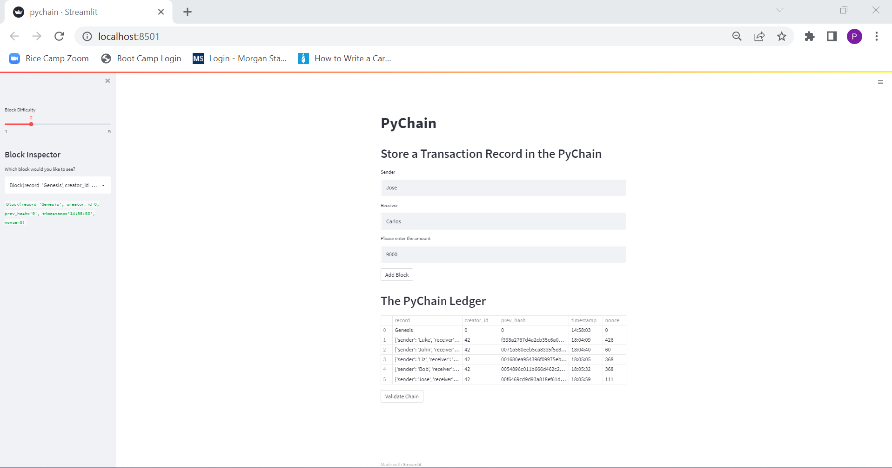
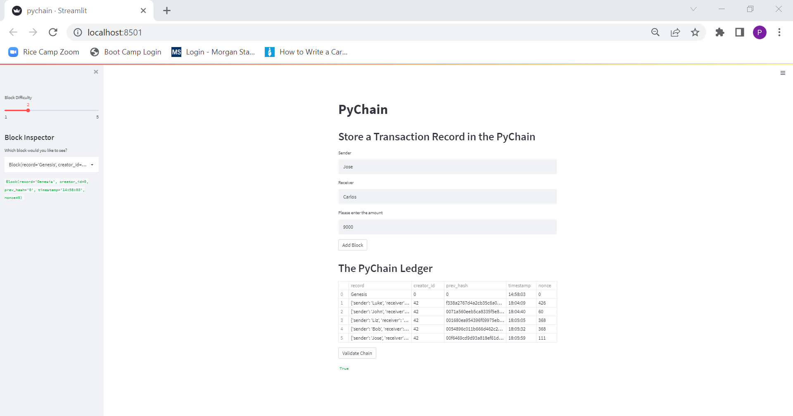

# Module18Challenge
Blockchain-Based Ledger System

In this challenge we have been tasked to build a blockchain-based ledger system (complete with a user-friendly web interface) that will allow partner banks to conduct financial transactions (that is, to transfer money between senders and receivers) and verify the integrity of the data in the ledger.

## Usage

In the terminal navigate to the project folder where the file pychain.py is located. 

Ensure the conda dev environment is activated.

Using CLI, please run the Streamlit application by using 'streamlit run pychain.py'.

### Streamlit with Multiple Blocks
Enter values for the sender, receiver, and amount, and then click the "Add
Block" button. Do this several times to store several blocks in the ledger.

### Streamlit with Blockchain Validation
Test the blockchain validation process by clicking "Validate Chain". The result is: True

## Contributors

Parag Borkar

---

© 2022 Trilogy Education Services, a 2U, Inc. brand. All Rights Reserved.
